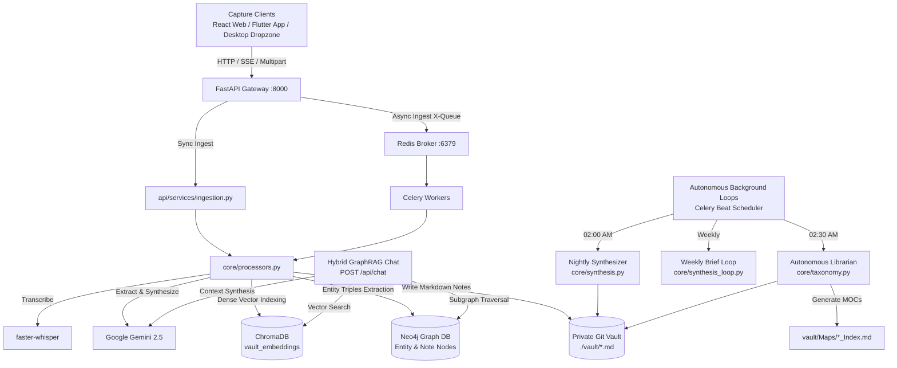

# 🏗️ Cortex Second Brain: Architecture & Data Flow

This document outlines the system architecture, component interactions, database topologies, and data flows of Cortex Second Brain.

---

## 1. High-Level Architecture Overview

Cortex Second Brain combines multi-modal ingestion, automated knowledge graph extraction, asynchronous task queues, and hybrid vector-graph retrieval.



---

## 2. Ingestion Pipeline & Data Flow

### A. Intake Channels
1. **Desktop Dropzone (`scripts/desktop_dropzone.py`)**:
   - `watchdog` detects file creations in `~/Desktop/CortexDrop`.
   - Sends `multipart/form-data` to `POST /api/ingest/file`.
   - On `200 OK`, moves the raw file into `~/Desktop/CortexDrop/Processed/`.
2. **Web Dashboard (`src/`)**:
   - URL submission with support for Server-Sent Events (`X-Stream: true`) or Async Queue (`X-Queue: true`).
3. **Flutter Cross-Platform App (`flutter_client/`)**:
   - Native Share Sheet receiver sends URLs to `POST /api/ingest` with `X-Queue: true`.

### B. Processing Stages
1. **Extraction**:
   - **PDFs**: Text and metadata extraction via `pypdf` with fallback to `pymupdf`.
   - **Audio/Video**: Transcription via `faster-whisper` (`large-v3-turbo`).
   - **Social URLs**: Media download and metadata extraction via `yt-dlp` / `instaloader`.
   - **Images**: Visual scene description via Gemini 2.5 Flash Vision.
2. **AI Analysis & Structuring**:
   - Gemini classifies content into a category (`Job-Career`, `Recipe`, `General`, `Event`, `Spot to Visit`, `Document`).
   - Generates an executive **AI Summary**, standardized tags, and clean Markdown content.
3. **Tripartite Storage**:
   - **Markdown Note**: Saved to `PROJECT_VAULT_PATH` and `OBSIDIAN_INBOX_PATH` with YAML frontmatter.
   - **ChromaDB**: Content chunks embedded and indexed in `vault_embeddings`.
   - **Neo4j**: Entities and relationships extracted via `extract_knowledge_graph` and upserted via `upsert_note_graph`.

---

## 3. Hybrid GraphRAG Retrieval (`/api/chat`)

When a user submits a query to `POST /api/chat`:

1. **Seed Entity Extraction**: Keywords and key concepts are extracted from the user query.
2. **ChromaDB Vector Retrieval**: Dense vector query retrieves top-5 semantically relevant text chunks.
3. **Neo4j Subgraph Traversal**: Neo4j executes a 1–2 hop Cypher traversal:
   ```cypher
   MATCH (e1:Entity)
   WHERE e1.name IN $names OR toLower(e1.name) IN $names_lower
   MATCH path = (e1)-[r*1..2]-(e2:Entity)
   WITH DISTINCT relationships(path) AS rels
   UNWIND rels AS rel
   RETURN startNode(rel).name AS source, type(rel) AS relation, endNode(rel).name AS target, rel.source_note AS source_note
   LIMIT 40
   ```
4. **Prompt Assembly**: Vector chunks and Graph relationships are fused into a structured prompt:
   ```markdown
   === Vector Knowledge Context ===
   {vector_chunks}

   === Knowledge Graph Relationships ===
   * FastAPI is WRITTEN_IN Python (Source: [[Backend Architecture]])
   * Celery is USES Redis (Source: [[Task Queue Setup]])

   Question: {user_query}
   ```
5. **Grounded Synthesis**: Gemini generates the final response with bidirectional Obsidian wiki links (`[[Concept Name]]`).

---

## 4. Autonomous Background Intelligence

| Task Name | Schedule | Core Module | Description |
| :--- | :--- | :--- | :--- |
| `nightly_vault_synthesis_task` | `02:00 AM UTC` | `core/synthesis.py` | Scans vault notes, queries ChromaDB for top-3 similar notes, finds unlinked title mentions, and appends a safe Semantic Footer (`## Related Notes`). |
| `nightly_taxonomy_task` | `02:30 AM UTC` | `core/taxonomy.py` | Clusters duplicate/synonymous tags with Gemini, updates note frontmatters in-place, and generates dynamic Maps of Content in `vault/Maps/<Category>_Index.md`. |
| `weekly_synthesis_task` | `Sunday 23:00 UTC` | `core/synthesis_loop.py` | Generates a comprehensive Weekly Synthesis digest summarizing notes captured during the week. |
| `daily_serendipity_task` | `Daily 08:30 UTC` | `core/serendipity.py` | Resurfaces spaced-repetition notes via Firebase Cloud Messaging push notifications. |
| `retroactive_backlink_task` | `Sunday 02:00 UTC` | `core/retroactive_backlink.py` | Discovers and weaves cross-vault bidirectional wiki links across newly created notes. |

---

## 5. Database Schema & Infrastructure

### Docker Compose Services
- **`cortex-redis`** (`redis:latest` on port `6379`): Serves as Celery message broker and result backend.
- **`cortex-neo4j`** (`neo4j:5-community` on ports `7474` HTTP and `7687` Bolt): Houses the knowledge graph.

### Neo4j Graph Schema
- **Nodes**:
  - `(:Note {title: String, created_at: DateTime, updated_at: DateTime})`
  - `(:Entity {name: String, type: String})`
- **Edges**:
  - `(:Note)-[:MENTIONS]->(:Entity)`
  - `(e1:Entity)-[:RELATION {source_note: String}]->(e2:Entity)` (e.g. `[:WRITTEN_IN]`, `[:USES]`, `[:PART_OF]`)

### Private Vault Git Isolation
- The `vault/` folder is maintained as an **independent Git repository**.
- The root repository excludes `vault/` via `.gitignore`.
- Backups are triggered on demand via `POST /api/sync`, which commits and pushes the private vault to its designated private upstream.
